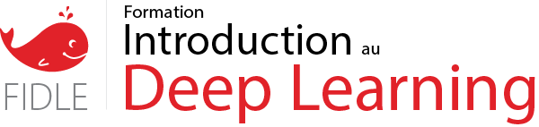

## A propos

Ce dépot contient l'ensemble des documents et liens de la **formation Fidle**.  

Les objectifs de cette formations, co-organisée par la formation continue du CNRS et les réseaux SARI et DEVLOG, sont :
 - Comprendre les **bases** des réseaux de neurones profonds (Deep Learning)
 - Développer une **première expérience** à travers des exemples simples et représentatifs
 - Comprendre les différents types de réseaux, leurs **architectures** et leurs **cas d'usages**
 - Appréhender les technologies **Tensorflow/Kera**s et **Jupyter lab**, sur GPU
 - Appréhender les **environnements de calcul académiques** tier-2 (méso) et/ou tier-1 (nationaux)

## disposibles dans ce dépot :
Vous trouverez ici :
 - le support des présentations
 - l'ensemble des travaux pratiques
 - des fiches et informations pratiques :
   - [Configuration SSH](-/wikis/howto-ssh)


```
## 1/ Environment
To run this examples, you need an environment with the following packages :
 - Python 3.6
 - numpy
 - Tensorflow 2.0
 - scikit-image
 - scikit-learn
 - Matplotlib
 - seaborn
 - pyplot

You can install such a predefined environment :
```
conda env create -f environment.yml
```

To manage conda environment see [there](https://docs.conda.io/projects/conda/en/latest/user-guide/tasks/manage-environments.html#)  


## 4/ Misc
To update an existing environment :  
```
conda env update --name=deeplearning2 --file=environment.yml
```

